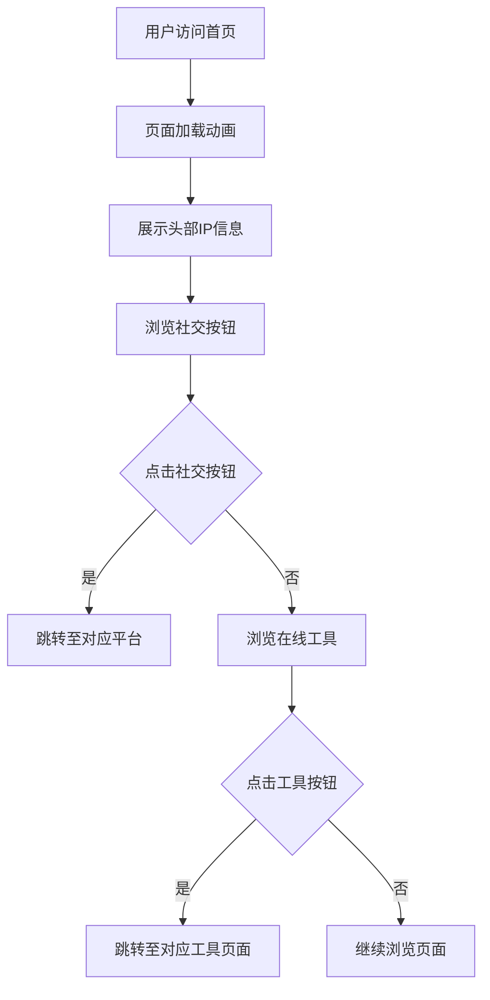

## 1. 产品概述

一个基于 Svelte 框架开发的暗黑极简风格二次元个人导航首页，用于集中展示个人信息、社交链接和常用在线工具入口。
- 主要目的：为个人品牌打造简洁酷炫的线上门户，方便访客快速了解博主信息并跳转至各平台
- 目标用户：博主的粉丝、访客，以及需要快速访问博主各平台链接的人群
- 产品价值：以极简暗黑美学呈现个人形象，提升个人品牌辨识度

## 2. 核心功能

### 2.1 功能模块
1. **首页（唯一页面）**：包含头部IP区、社交按钮模块、在线工具模块三大核心模块

### 2.2 页面详情
| 页面名称 | 模块名称 | 功能描述 |
|----------|----------|----------|
| 首页 | 头部IP区 | 圆形头像（预留替换接口）、大号粗体中文名称、英文标语、灰色圆角状态标签 |
| 首页 | 社交按钮模块 | 深灰卡片容器内横向排布胶囊按钮（B站、QQ、Github），每个按钮含Font Awesome图标+文字 |
| 首页 | 在线工具模块 | 深灰卡片容器内分行排列功能胶囊按钮（博客、封面图制作、云盘、站点统计），自适应排列 |

## 3. 核心流程

用户访问页面后的浏览流程：

## 4. 用户界面设计

### 4.1 设计风格
- **配色方案**：
  - 全局背景：#000 纯黑色
  - 卡片容器：#171717 深灰色
  - 主文字：#ffffff 纯白色
  - 辅助文字：#aaaaaa 浅灰色
  - 按钮选中态：#ffffff 白色填充
  - 状态标签背景：#333333
- **按钮样式**：统一圆角胶囊样式（border-radius: 999px），纯扁平无阴影
- **字体**：中文使用思源黑体/系统默认，英文使用 distinctive 字体
- **圆角**：统一 20px 大圆角（卡片），按钮 999px 全圆角
- **图标**：Font Awesome 线性图标（solid/regular 风格）
- **布局**：垂直流式布局，水平居中，最大宽度 800px

### 4.2 页面设计概览
| 页面名称 | 模块名称 | UI元素 |
|----------|----------|--------|
| 首页 | 头部IP区 | 圆形头像100-120px、中文名称28-32px/700字重、英文标语14-16px/#aaaaaa、状态标签24px高/#333背景/12px字体 |
| 首页 | 社交按钮模块 | #171717卡片/20px圆角、胶囊按钮40-48px高/999px圆角、Font Awesome图标+文字、按钮间距10-15px |
| 首页 | 在线工具模块 | #171717卡片/20px圆角、功能胶囊按钮自适应排列（每行2-4个）、与社交按钮视觉一致 |

### 4.3 响应式
- PC端（≥1024px）：固定宽度居中容器，最大宽度 800px
- 移动端（≤768px）：自适应屏幕宽度，保持内容居中，按钮自动换行排列
- 模块间距：30-40px

### 4.4 交互动效
- 按钮 hover：轻微白色透明度变化（background-color: rgba(255,255,255,0.1)）
- 过渡动画：transition: all 0.2s ease-in-out
- 页面加载：简洁的渐入效果
- 纯扁平设计，无任何立体阴影
