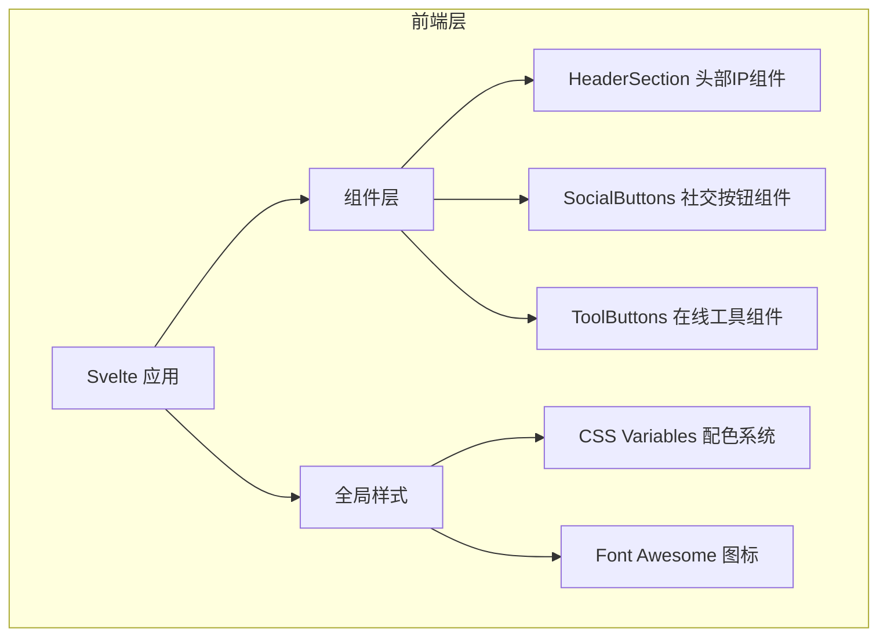

## 1. 架构设计



## 2. 技术说明

- 前端框架：Svelte 5（最新稳定版）
- 构建工具：Vite
- 初始化方式：使用 `npm create svelte@latest` 创建项目
- 样式方案：Scoped CSS（Svelte 内置 `<style>` 标签）
- 图标方案：Font Awesome CDN 引入
- 部署方式：静态站点，可直接部署至任意静态托管服务

## 3. 路由定义

| 路由 | 用途 |
|------|------|
| / | 首页 - 个人导航页，包含所有模块 |

## 4. 组件结构

```
src/
├── App.svelte          # 主应用组件，组装所有模块
├── main.js             # 入口文件
├── components/
│   ├── HeaderSection.svelte    # 头部IP区组件
│   ├── SocialButtons.svelte    # 社交按钮组件
│   └── ToolButtons.svelte      # 在线工具组件
└── assets/
    └── avatar.png              # 头像占位图（预留替换接口）
```

## 5. 配色系统（CSS Variables）

```css
:root {
  --bg-primary: #000000;        /* 全局背景 */
  --bg-card: #171717;           /* 卡片容器 */
  --text-primary: #ffffff;      /* 主文字 */
  --text-secondary: #aaaaaa;    /* 辅助文字 */
  --btn-active: #ffffff;        /* 按钮选中态 */
  --tag-bg: #333333;            /* 状态标签背景 */
  --radius-card: 20px;          /* 卡片圆角 */
  --radius-btn: 999px;          /* 按钮圆角 */
}
```

## 6. 数据模型

页面数据通过组件内常量定义，无需后端：

| 数据项 | 类型 | 说明 |
|--------|------|------|
| profile | Object | 头像URL、名称、标语、状态标签 |
| socialLinks | Array | 社交平台链接列表（名称、图标、URL） |
| toolLinks | Array | 在线工具链接列表（名称、图标、URL） |
