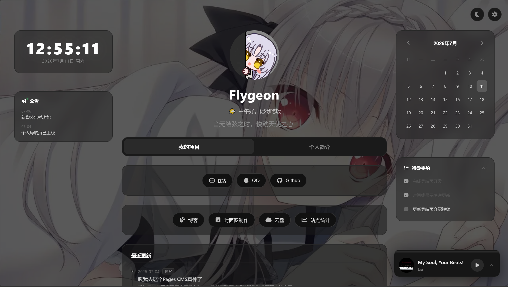

# 个人导航页（anime-navigation）


一个基于 **Svelte 5 + Vite 6** 的暗黑风格个人导航页，集成了个人简介、项目入口、音乐播放器、RSS 时间线、公告栏和多个侧边小组件。

## 特性

- **单页应用**，通过标签页在「项目」与「简介」之间切换
- **头像头部区**，支持主题切换、设置面板、动态打字机签名
- **粒子特效**：雪花 / 樱花 / 关闭
- **外链跳转过渡动画**，可在设置中开启或关闭
- **音乐播放器**，支持播放列表、单曲循环、随机播放、音量与进度控制
- **RSS 时间线**，自动拉取博客更新并与静态条目合并展示
- **侧边小组件**：时钟、日历、待办、公告栏
- **Cookie 持久化**，保存主题、特效、组件显隐等设置

## 技术栈

- **Svelte 5**（runes 模式）
- **Vite 6**
- **Font Awesome 7**
- **纯 JavaScript**，无 TypeScript

## 项目启动

### 安装依赖

```bash
npm install
```

### 开发模式

```bash
npm run dev
```

默认运行在：`http://localhost:5173`

### 生产构建

```bash
npm run build
```

### 预览构建结果

```bash
npm run preview
```

## 数据配置

项目配置集中在：

- `src/data/config.js`

里面包含：

- `music`：音乐播放器歌单
- `timeline`：静态时间线
- `notices`：公告栏内容
- `todos`：待办事项
- `linkTransition`：外链跳转动画配置
- `devices`：设备展示数据
- `skills`：技能展示数据

> 之所以使用 `config.js`，是为了方便给配置内容添加注释。

## 主要目录结构

```text
src/
├── App.svelte
├── main.js
├── components/
│   ├── HeaderSection.svelte
│   ├── SocialButtons.svelte
│   ├── ToolButtons.svelte
│   ├── TabSwitcher.svelte
│   ├── Snowflakes.svelte
│   ├── CherryBlossom.svelte
│   ├── MusicPlayer.svelte
│   ├── BioSection.svelte
│   ├── Timeline.svelte
│   ├── LinkTransitionOverlay.svelte
│   ├── ClockWidget.svelte
│   ├── CalendarWidget.svelte
│   ├── NoticeBoard.svelte
│   ├── TodoWidget.svelte
│   ├── CookieConsent.svelte
│   ├── DeviceSection.svelte
│   └── SkillsSection.svelte
├── data/
│   └── config.js
└── lib/
    └── cookie.js
```

## 说明

- 外部链接由 `SocialButtons`、`ToolButtons` 触发，并在 `App.svelte` 中统一处理跳转逻辑。
- `Timeline.svelte` 会尝试请求 RSS 源并与本地静态时间线合并。
- 设置会通过 Cookie 保存，刷新页面后仍然有效。